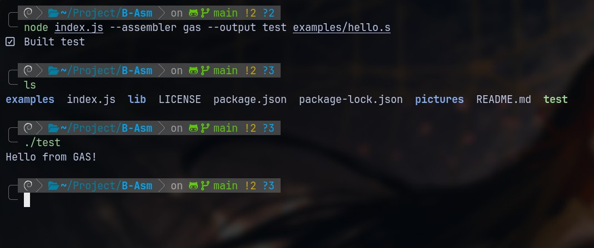

# B-Asm

A unique builder for your ASM projects, built using Node.js technology.
This builder automatically detects .asm files, making it very convenient to compile your project.

> Supports NASM and GNU Assemblers!

## Features

- Automatic detection of .asm or .s files based on assembler
- Support for NASM and GAS assemblers
- Automatic output naming from input file
- Cross-platform linking (Linux, Windows, macOS)
- Library linking with -l flags
- Include directories support
- Clean build option
- Verbose mode

## Example usage 


## 🧠 Using the builder

Basic project build

```bash

node index.js [input.asm]

```


With your options

```bash

node index.js [options][input.file]

```


## 📂 Usage example 


Compiling a NASM file (output: hello)

```bash

node index.js hello.asm

```


Compiling all .asm files in the current directory

```bash

node index.js

```


Compile with the GAS assembler 

```bash

node index.js --assembler gas hello.s

```


Please see the help for more details


MIT License 


Author AlexVoste
