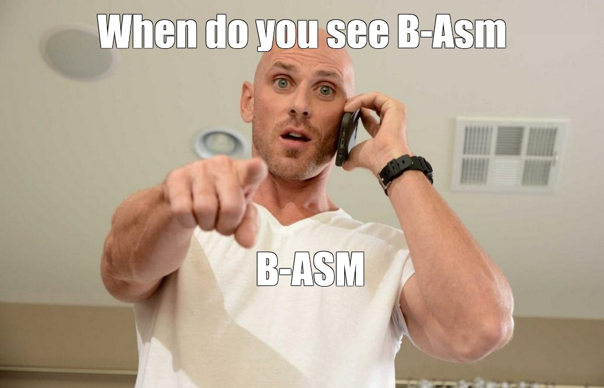

# B-Asm

A unique builder for your ASM projects, built using Node.js technology.
This builder automatically detects .asm files, making it very convenient to compile your project.

> Supports NASM and GNU Assemblers!

## Features

- Automatic detection of .asm or .s files based on assembler
- Support for NASM and GAS assemblers
- Automatic output naming from input file
- Cross-platform linking (Linux, Windows, macOS)
- Library linking with -l flags
- Include directories support
- Clean build option
- Verbose mode

## Usage

### Basic build
node builder.js [input.asm]

### With options
node builder.js [options] [input.file]

### Examples

# Build specific NASM file (output: hello)
node builder.js hello.asm

# Build all .asm files in directory
node builder.js

# Build with GAS assembler
node builder.js --assembler gas hello.s

# Build with custom format and output
node builder.js hello.asm --format elf32 --output myprogram

# Build with libraries
node builder.js main.asm --link-libs m,c

# Build with include directories
node builder.js main.asm --include ./inc --include ./lib

# Build with cleanup and verbose output
node builder.js --verbose --clean

# Show help
node builder.js -h
